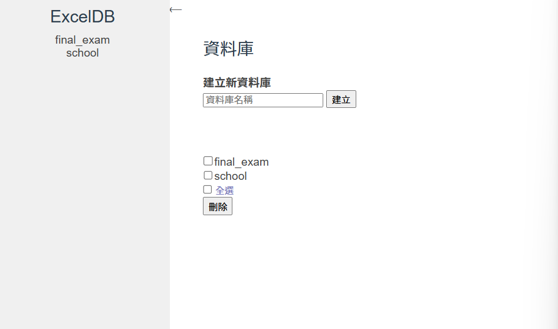
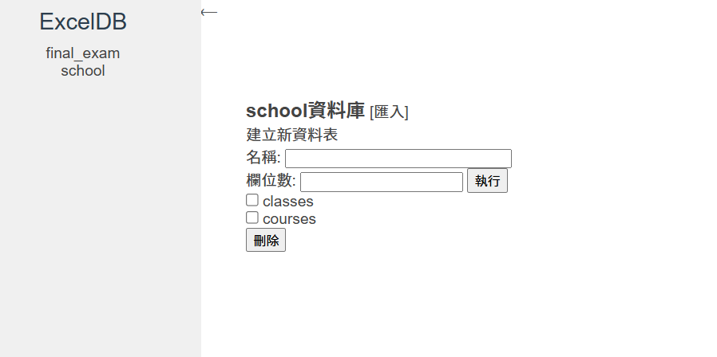
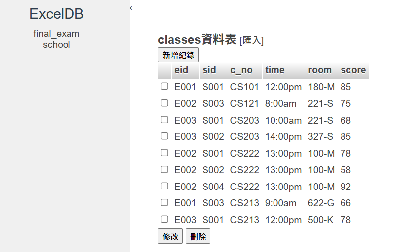

# database-system
# ExcelDB - Excel 資料庫系統

## 專案簡介

ExcelDB 是一套以 PHP 開發的 Excel 資料庫模擬系統，使用者可以透過網頁介面建立、管理和操作「資料庫」、「資料表」與「資料列」資料，並支援匯入、修改、刪除、查詢等基本功能，適合資料管理教學與簡易系統模擬用途。

---

## 功能列表

### 資料庫管理
- ✅ 建立新資料庫（資料夾） `adddatabase.php`
- ✅ 刪除資料庫 `deletedatabase.php`
- ✅ 顯示資料庫列表 `home.php`

### 資料表管理
- ✅ 建立新資料表（Excel/CSV 檔）`addtable.php`, `createTable.php`
- ✅ 刪除資料表 `deletetable.php`
- ✅ 匯入資料表 `chooseImportTable.php`, `import.php`, `importData.php`
- ✅ 顯示資料表列表 `displayTable.php`

### 資料列操作
- ✅ 新增資料列 `adddata.php`, `createData.php`
- ✅ 修改資料列 `modify.php`, `modifyData.php`
- ✅ 刪除資料列 `deleteData.php`
- ✅ 匯入資料列 `chooseImportData.php`

### 權限管理（進階功能）
- ✅ 設定管理員權限 `grant_admin_permissions.php` （可自行擴充）

---

## 資料結構說明

- 每個「資料庫」對應一個資料夾（如 `final_exam/`、`school/`）
- 每個「資料表」儲存為一個 Excel 或 CSV 檔案
- 使用者操作介面透過 PHP + HTML 表單實作，並將資料讀寫於伺服端檔案中

---
## 使用方式

1. 將本專案部署至支援 PHP 的 Web 伺服器（如 XAMPP / WAMP / MAMP）
2. 開啟瀏覽器進入系統首頁：  
   👉 [http://127.0.0.1:5050/ExcelDataBase/home.php](http://127.0.0.1:5050/ExcelDataBase/home.php)
3. 使用者可：
   - 建立資料庫 → 新增資料表 → 編輯資料
   - 匯入或刪除資料、修改資料表
   - 管理者可進行權限設定

## 系統特色

- 完全基於檔案系統，模擬資料庫結構
- 操作介面簡潔，方便學生與教師使用
- 支援 Excel / CSV 檔匯入
- 權限管理模組可擴充

---

## 🖼 使用者介面（UI 預覽）

### 系統首頁（資料庫列表）

### 資料庫畫面

### 資料表顯示資料內容

---

## DEMO

系統操作展示影片：  
[https://www.youtube.com/watch?v=dLm4wV8xYRg](https://www.youtube.com/watch?v=dLm4wV8xYRg)

---

## 作者資訊

專題作者：`黎子崴` 、`吳雨宣`  
學校/課程名稱：`NUK / Database Systems`  
學期：`2023年(112學年第一學期)`